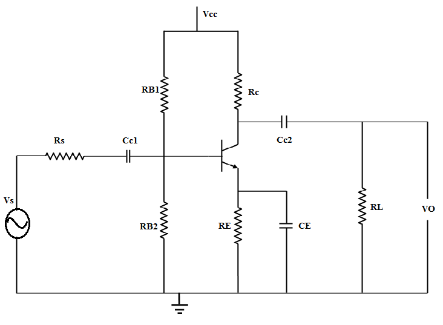
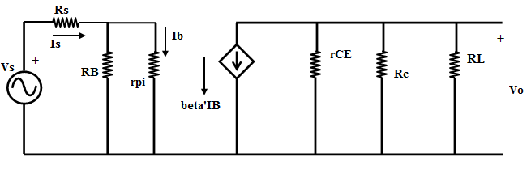
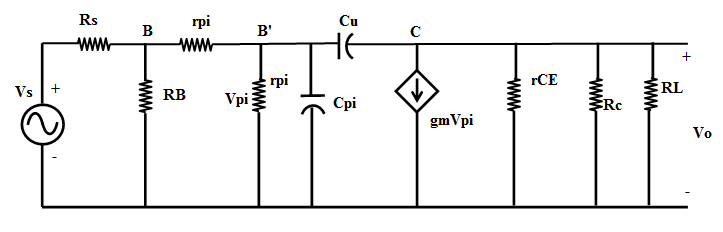

# Theory

The common emitter configuration is widely used as a basic amplifier as it has both voltage and current amplification.
Resistors RB1 and RB2 form a voltage divider across the base of the transistor. The function of this network is to provide necessary bias condition and ensure that emitter-base junction is operating in the proper region.

In order to operate transistor as an amplifier, biasing is done in such a way that the operating point is in the active region. For an amplifier the Q-point is placed so that the load line is bisected. Therefore, in practical design VCE is always set to VCC/2. This will confirm that the Q-point always swings within the active region. This limitation can be explained by maximum signal handling capacity. For the maximum input signal, output is produced without any distortion and clipping.

### The Bypass Capacitor

The emitter resistor RE is required to obtain the DC quiescent point stability. However the inclusion of RE in the circuit causes a decrease in amplification at higher frequencies. In order to avoid such a condition, it is bypassed by a capacitor so that it acts as a short circuit for AC and contributes stability for DC quiescent condition. Hence capacitor is connected in parallel with emitter resistance.

$$X_{CE}<< R_E$$
$$\frac{1}{2  \pi  f  C_E} << R_E$
$$C_E >> \frac{1}{2  \pi  f  R_E}$$

### The Input/ Output Coupling (or Blocking) Capacitor

An amplifier amplifies the given AC signal. In order to have noiseless transmission of a signal (without DC), it is necessary to block DC i.e. the direct current should not enter the amplifier or load. This is usually accomplished by inserting a coupling capacitor between two stages.

$$X_{CC} << R_i h_{ie}$$
$$ \frac{1}{2 \pi f C_C} << R_i h_{ie}$$
$$C_C >> \frac{1}{2 \pi f (R_i  h_{ie})}$$

CC  - Output Coupling Capacitor
CB - Input Coupling Capacitor

### Frequency response of Common Emitter Amplifier

Emitter bypass capacitors are used to short circuit the emitter resistor and thus increases the gain at high frequency. The coupling and bypass capacitors cause the fall of the signal in the low frequency response of the amplifier because their impedance becomes large at low frequencies. The stray capacitances are effectively open circuits. In the mid frequency range large capacitors are effectively short circuits and the stray capacitors are open circuits, so that no capacitance appears in the mid frequency range. Hence the mid band frequency gain is maximum. At the high frequencies, the bypass and coupling capacitors are replaced by short circuits. The stray capacitors and the transistor determine the response.

The input resistance is medium and is essentially independent of the load resistance RL . The output resistance is relatively high and is essentially independent of the source resistance.

Figure 1 

The coupling capacitor, CC1 , couples the source voltage VS to the biasing network. Coupling capacitor CC2 connects the collector resistance RC to the load RL . The bypass capacitance CE is used to increase the midband gain, since it effectively short circuits the emitter resistance RE at midband frequencies. The resistance RE is needed for bias stability. The external capacitors CC1, CC2, CE will influence the low frequency response of the common emitter amplifier. The internal capacitances of the transistor will influence the high frequency cut-off.

$$A(s)=\frac{A_m  S^2 (S+w_Z)}{(S+w_{L1})(S+w_{L2})(S+w_{L3}) (1+ \frac{S}{w_H})}$$

where,
AM is the midband gain,
wH is the frequency of the dominant high frequency pole,
wL1, wL2, wL3 are low frequency poles introduced by the coupling and bypass capacitors,
wZ is the zero introduced by the bypass capacitor.

The midband gain is obtained by short circuiting all the external capacitors and open circuiting the internal capacitors. Figure 2 shows the equivalent for calculating the midband gain.

Figure 2 

$$A_m=\frac{V_o}{V_s} =-&#946; [r_{CE}|| R_C || R_L][\frac{R_B}{R_B+r_{pi}}][\frac{1}{R_S+(R_B||r_{pi})}]$$ 
It can be shown that the low frequency poles, \(w_{L1}\), \(w_{L2}\), \(w_{L3}\) can be obtained,by the following equations:
$$&#964;_1=\frac{1}{w_{L1}}=C_{C1} R_{IN}$$
where,  $$R_{IN}=R_{S}+[R_B || r_{pi}]$$
$$&#964;_2=\frac{1}{w_{L2}}=C_{C2} [R_{L}+(R_C || r_{CE})]$$
$$&#964;_3=\frac{1}{w_{L3}}=C_E  R'_E$$
$$R'_E=R_E || [\frac{r_{pi}}{&#946;_F +1}+(\frac{R_B || R_S}{&#946;_F +1})]$$
$$w_Z=\frac{1}{R_E \times C_E}$$
Normally,wZ < wL3 and the low frequency cut-off \(w_L\) is larger than thelargest pole frequency. The low frequency cut-off can be approximated as
$$w_L&#8773;\sqrt(w_{L1})^2+(w_{L2})^2+(w_{L3})^2$$

The high frequency equivalent circuit of the common-emitter amplifier is shown in Figure 3.

Figure 3 

In Figure 3, Cμ is the collector-base capacitance, Cπ is the emitter to base capacitance, rX is the resistance of silicon material of the base region between the base terminal B and an internal or intrinsic base terminal B’. Using the Miller Theorem, it can be shown that the 3-dB frequency at high frequencies is approximately given as

$$w_H^{-1}=(r_{pi}||[r_x+(R_B||R_S)]) C_T$$
where,
$$C_T=C_&#960;+C_&#956;[1+g_m(R_L|| R_C)]$$ and $$g_m=\frac{I_C}{V_T}$$

